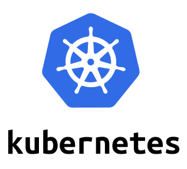
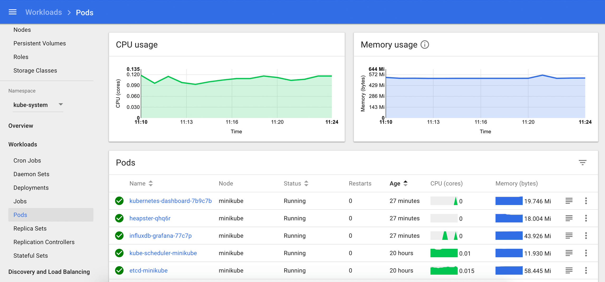

For this scenario, Katacoda has just started a fresh Kubernetes cluster for you. Verify that it's ready for your use:

`kubectl version --short && \
kubectl get nodes && \
kubectl get componentstatus && \
kubectl cluster-info`{{execute}}

It should list a 2-node cluster and the control plane components should be reporting _Healthy_. If it's not healthy, try again in a few moments. If it's still not functioning refresh the browser tab to start a fresh scenario instance before proceeding.

The [Helm](https://helm.sh/) package manager used for installing applications on Kubernetes is also available:

`helm version --short`{{execute}}

## Kubernetes Dashboard ##

You can administer your cluster with the `kubectl` CLI tool or use the visual [Kubernetes dashboard](https://[[HOST_SUBDOMAIN]]-30000-[[KATACODA_HOST]].environments.katacoda.com/). The Dashboard can be accessed from the tab labeled _Kubernetes Dashboard_ above the command line. When the Dashboard first appears, it will prompt for an access token. At any time you can run this script to access the Dashboard token:

`token.sh`{{execute}}

This script will display the token in the terminal. Copy the green text using your browser's copy feature then paste the token into the prompt when the Dashboard is accessed. If the Dashboard is still starting up, then Katacoda will report the access error. Once the dashboard Pod reports the status _Running_ it can be accessed:

`kubectl get pods -n kube-system -l app.kubernetes.io/name=kubernetes-dashboard`{{execute}}
