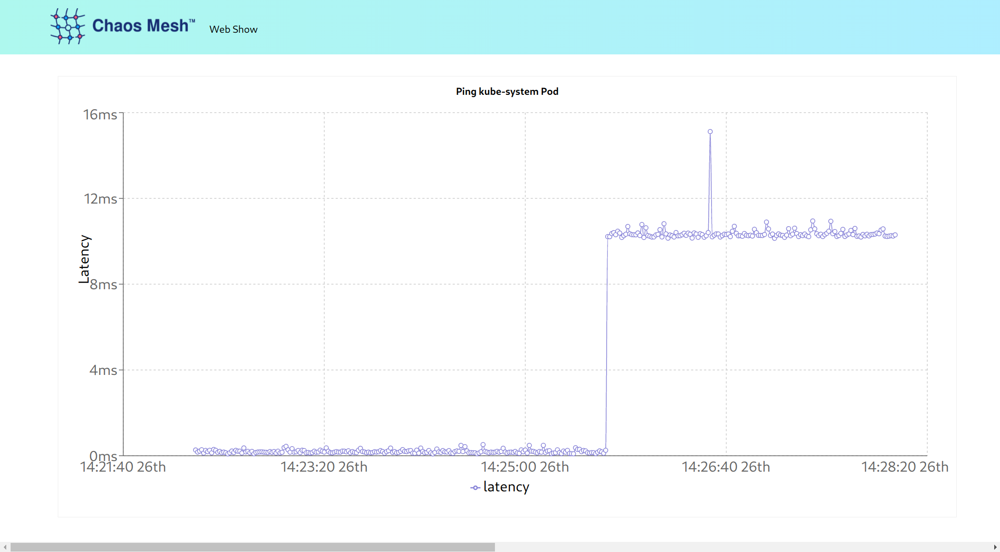

Your first experiment will apply a network delay to an application.

## Install Example Web-show application

Install an example application as a target for the experiment. This application is designed by the Chaos Mesh project as a _hello world_ example for your first experiment. The Deployment and Service YAMLs have been provided. The application needs an environment variable for the TARGET_IP, which is the cluster IP, so this context you provide as a ConfigMap. That ConfigMap variable is referenced in the Deployment YAML.

Create the ConfigMap with the IP context:

`TARGET_IP=$(kubectl get pod -n kube-system -o wide| grep kube-controller | head -n 1 | awk '{print $6}')`{{execute}}

`kubectl create configmap web-show-context --from-literal=target.ip=${TARGET_IP}`{{execute}}

Apply the Deployment and Service declarations:

`kubectl apply -f web-show-deployment.yaml`{{execute}}

`kubectl apply -f web-show-service.yaml`{{execute}}

It will take a moment to start. You can see the application status and the Pods status will soon report _Running_ in the default namespace:

`kubectl get deployments,pods,services`{{execute}}

With the web-show application running, its web interface can be accessed from the "Web Show" above the command-line area or this link: https://[[HOST_SUBDOMAIN]]-30081-[[KATACODA_HOST]].environments.katacoda.com/.

## Define Experiment

The Chaos Mesh has installed several custom resources:

`kubectl get crds`{{execute}}

You can reference these resources to create declarative YAML manifests that define your experiment. For your first experiment, you will impose a _network delay_. The delay is defined in the _NetworkChaos_ manifest this way:

`ccat network-delay-experiment.yaml`{{execute}}

The experiment declares that a 10ms network delay should be injected. The delay will only be applied to the target service labeled "app": "web-show". This is the _blast radius_. Only the web-show app has that label:

`kubectl get deployments,pods -l app='web-show'`{{execute}}

## Apply Experiment

Because the Chaos Mesh follows the Kubernetes Operator pattern with CRDs, the experiment can be applied like any other Kubernetes object.

`kubectl apply -f network-delay-experiment.yaml`{{execute}}

The experiment is now running.

`kubectl get NetworkChaos`{{execute}}

## Observe

Access the [web-show application](https://[[HOST_SUBDOMAIN]]-30081-[[KATACODA_HOST]].environments.katacoda.com/.
) (or use the tab). The application has a built-in graph that will show the latency it's experiencing. With the experiment applied you will see the 10ms delay. Look at the dashboard, find the experiment, and drill down on its details.

## Update Experiment

At any time you can change the YAML declaration and apply further experiment updates with:

`kubectl apply -f network-delay-experiment.yaml`{{execute}}

The experiment can be paused:

`kubectl annotate networkchaos web-show-network-delay experiment.chaos-mesh.org/pause=true`{{execute}}

and resumed:

`kubectl annotate networkchaos web-show-network-delay experiment.chaos-mesh.org/pause-`{{execute}}

Since the NetworkChaos is like any other Kubernetes resource, the experiment can be easily removed.

`kubectl delete -f network-delay-experiment.yaml`{{execute}}
