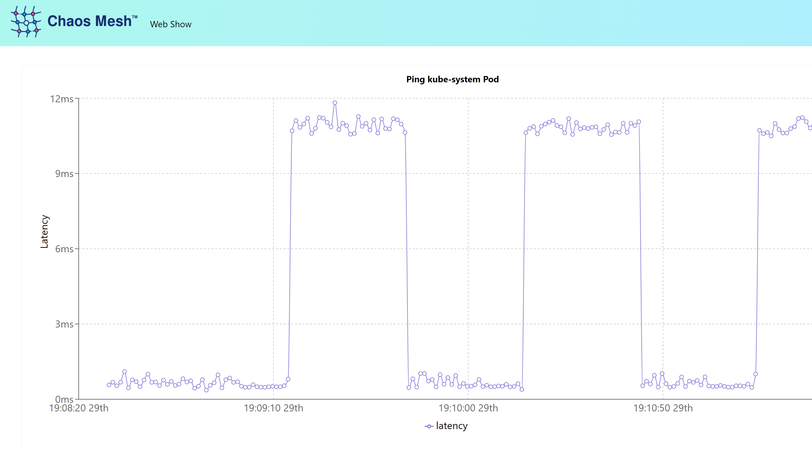

Let's take a look on schduled experiement.

## Define Scheduled Experiment

Based on the previous network delay experiment, this experiment will inject network chaos periodically: 10ms network delay should be injected **every minute** that **lasts for 30 seconds**:

`ccat scheduled-network-delay-experiment.yaml`{{execute}}

The experiment declares that a 10ms network delay should be injected every minute that lasts for 30 seconds. The delay will only be applied to the target service labeled "app": "web-show". This is the _blast radius_. Only the web-show app has that label:

`kubectl get deployments,pods -l app='web-show'`{{execute}}

## Apply Scheduled Experiment

Apply the scheduled experiment.

`kubectl apply -f scheduled-network-delay-experiment.yaml`{{execute}}

The schedule experiment is now running. Scheduled experiment will not create `NetworkChaos` object immediately, intead it creates an `Schedule` object called `web-show-scheduled-network-delay`. 

`kubectl get Schedule`{{execute}}

The relationship between `Schedule` and `NetworkChaos` is very similar with what between `CronJob` and `Job`: `Schedule` will spawn `NetworkChaos` when trigger by `@every 60s`.

`kubectl get NetworkChaos -w`{{execute}}

## Observe

Access the [web-show application](https://[[HOST_SUBDOMAIN]]-30081-[[KATACODA_HOST]].environments.katacoda.com/.
) (or use the tab). The application has a built-in graph that will show the latency it's experiencing. With the experiment applied you will see the 10ms delay every 30 seconds. Look at the dashboard, find the experiment, and drill down on its details.

## Update Scheduled Experiment

At any time you can change the YAML declaration and apply further experiment updates with:

`kubectl apply -f scheduled-network-delay-experiment.yaml`{{execute}}

The experiment can be paused:

`kubectl annotate schedule web-show-scheduled-network-delay experiment.chaos-mesh.org/pause=true`{{execute}}

and resumed:

`kubectl annotate schedule web-show-scheduled-network-delay experiment.chaos-mesh.org/pause-`{{execute}}

Since the NetworkChaos is like any other Kubernetes resource, the experiment can be easily removed.

`kubectl delete -f scheduled-network-delay-experiment.yaml`{{execute}}
