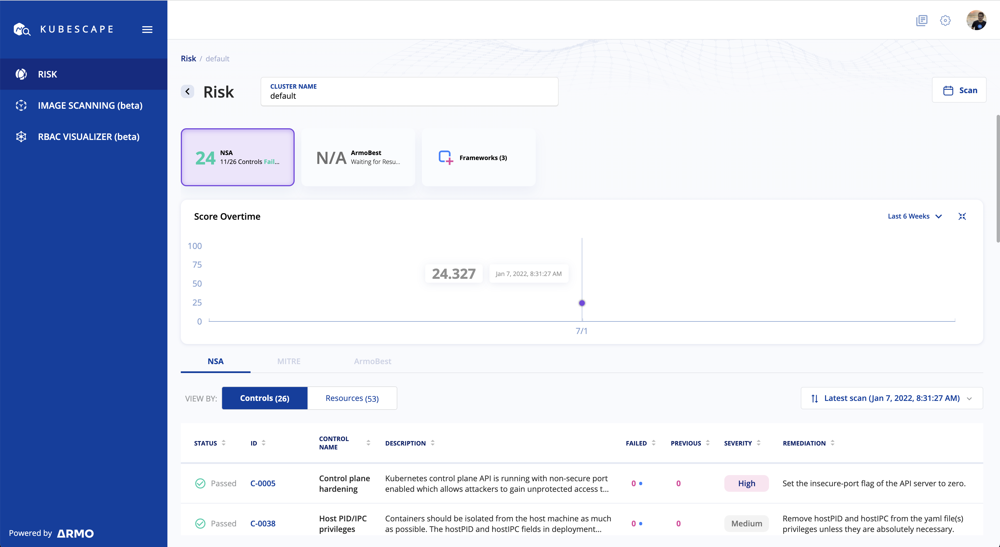

Kubescape scans K8s clusters, YAML files, and HELM charts, and detect misconfigurations and software vulnerabilities at early stages of the CI/CD pipeline and provides a risk score instantly and risk trends over time. Kubescape integrates natively with other DevOps tools, including Jenkins, CircleCI and Github workflows.

This Katacoda scenario comes pre installed with a single node K3s cluster and kubescape installed. 

## Scan the cluster

In order to scan the cluster just run  `kubescape scan`{{execute}}

## Visualization 

You can also view the scanned result in a UI but you have to sign up using this link first https://portal.armo.cloud/cli-signup  and then run the commands with your account token run `kubescape scan framework nsa --submit --account=YOUR_ACCOUNT_ID`{{execute}}
Below is how the scan result will look like:

